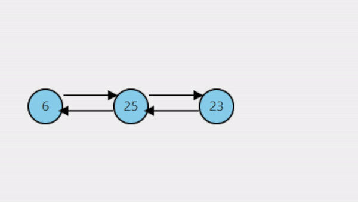

# DataStructViz

DataStructViz is a web application to visualise data-structure operations (e.g., insertion, deletion, searching) with interactive, step-by-step animations, aimed at students and educators to simplify complex algorithmic concepts.
Link for the app: https://datastructviz.co.uk/

  
  
  
  
  

# 💻 Tech Stack:
                

## 🚀 Features

- Visualize operations such as insertion, deletion, searching in various data structures. Also the code displayed highlights the current line for the given step in the algorithm giving you the best experience for better understanding what is happening behind the scene.

  

- Give our interactive quiz a shot and see how well you really know your data structures, then snag custom feedback based on your answers. You can even chat with our integrated bot about anything under the tech sun—just don’t ask for recipe tips, because it hasn't quite made its MasterChef debut... yet!

  

- Adding and editing quiz topics, questions, and answers has never been easier—assuming you have admin privileges, of course!
   
  

## 🚧 Future features 

- I’m on track with implementing a user quiz scoring system. So far, I’ve set up authentication and authorization using the Identity library and JWT (JSON Web Tokens), which I need for the Admin role to manage quiz data.
- By March I plan to add a few hundreds of questions and a system to randomise questions in quizzes.
- Since this is still an MVP, I'll also improve the front end by using libraries like Bootstrap. Sure, I'm no Picasso or Einstein, but hey—full-stack engineering is trending, so let’s juggle brushstrokes and breakpoints like pros!
- Also, I'll do my best to implement a caching system—or at least pagination—for quizzes. Querying the database can take a while… I know.

## 🛠️ Usage

You can download the zip file from this repository and just run it on visual studio. Be careful to run BlazorAppForDataStructures project because the solution consists of 2 projects, one is for the underlying logic of data structures and the other one is a Blazor project, the one that you actually want to run. 
- Also the app makes calls to OpenAI API for custom feedback at the end of the quiz and the API key is securely stored on the Azure Web Service Instance so you won't be able to access it. If you prefer you can put your own API key there and make use of the feature.
- Another point that is worth mentioning is the fact that the app uses an internal CRUD API for managing quiz related businesses and also the login and register sections. The API is up and running but there is a hashing key stored securely on the API server and is not accessible making the previously mentioned features unusable. You can still make your own quizzes by updating the latest migration and add questions manually from SQL tool such as Azure SQL Studio.

## 🤝 Contributing
DataStructViz does not stop here and I would love more people to get involved in the project. Whether you have ideas to share, bugs to report, or features to implement, your contributions are welcome!

### How to Contribute
1. **Propose Ideas and Discuss Features:**
   - You can open a topic by [openning a new discussion](https://github.com/andulica/DataStructuresVisualizer/discussions/25).

2. **Report Bugs:**
   - Found a bug? [Open an issue](https://github.com/andulica/DataStructuresVisualizer/issues/new?template=Blank+issue). Include details, reproduction steps, and any relevant screenshots or logs.

3. **Implement Features:**
   - Indicate your intent to work on a feature by commenting in the [feature discussion](https://github.com/andulica/DataStructuresVisualizer/discussions/25) or starting a new one if it doesn't exist. This helps avoid duplicated efforts and allows maintainers to provide guidance.
   - Fork the repository and branch off `master`.
   - Implement your feature following the project’s coding standards.
   - [Open a pull request](https://github.com/andulica/DataStructuresVisualizer/pulls) targeting the `master` branch.

### Code Style and Commit Messages
- **Code Formatting:** Use `clang-format` to ensure consistency. Many editors can apply `clang-format` automatically when saving.
- **Commit Messages:** Follow the [Conventional Commits](https://www.conventionalcommits.org/) style to maintain a clear and informative history:
  - `feat`: New features.
  - `fix`: Bug fixes.
  - `docs`: Documentation updates.
  - `style`: Code style changes.
  - `refactor`: Refactoring without changing functionality.
  - `test`: Adding or modifying tests.
  - `chore`: Maintenance tasks.
  - `merge`: Merging branches or pull requests. Examples:
    - `merge: feature-branch-xxx into feature-branch`
    - `merge: remote feature-branch into local feature-branch`
    - `merge: pull request #12 from feature-branch`

